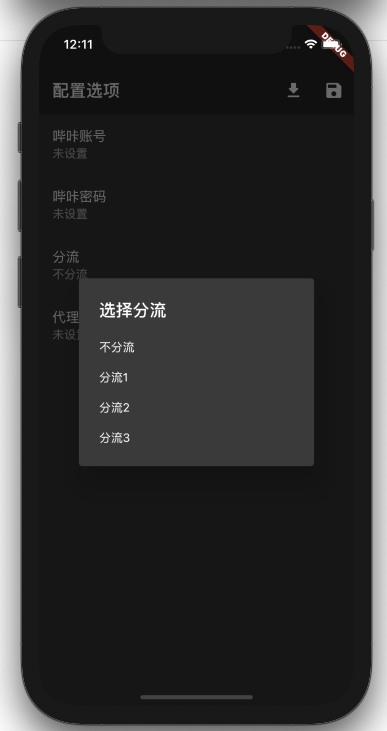
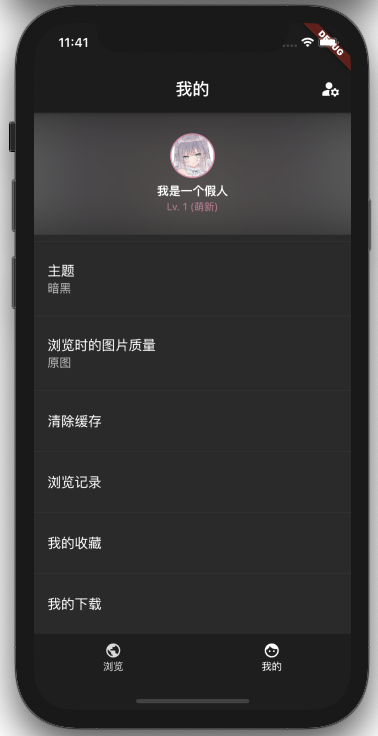
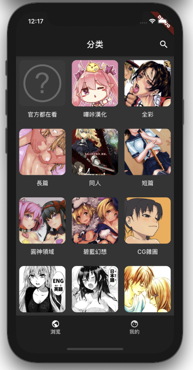
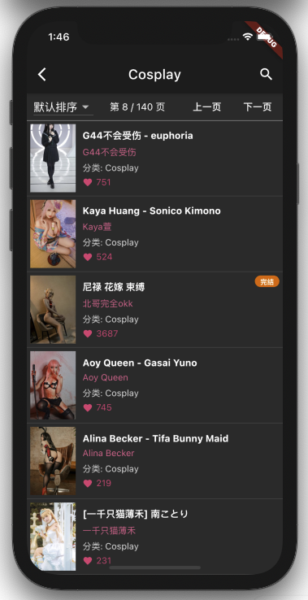

PIKAPI - 哔咔客户端
========
一个全平台的, 无广告的, 哔咔漫画客户端, 能运行在 Windows/MacOS/Linux/Android/IOS中。

## 界面 / 功能

### 登录/分流

您还是需要一个哔卡账户登录的, 否则将无法使用本软件。

VPN->代理->分流, 这三个功能如果同时设置, 您会在您手机的VPN上访问代理, 使用代理请求分流服务器, 所以最好只设置一个, 分流2/3在北京地区网速非常良好。

 

### 漫画分类/搜索

 


### 漫画阅读/下载/导入/导出

您可以在除IOS外导出任意已经完成的下载到zip, 从另外一台设备导入。
导出的zip解压后可以直接使用其中的HTML进行阅读


### 游戏


## 特性

- [x] 用户
  - [x] 登录
  - [ ] 注册
  - [x] 获取个人信息 / 自动打哔卡
- [x] 漫画
  - [x] 分类 / 搜索 / 在分类中搜索
  - [x] 漫画详情 / 章节 / 看图
  - [x] 收藏
  - [ ] 评论 / 看此本子的也在看
  - [ ] 排行榜
- [x] 游戏
  - [x] 列表 / 详情
  - [ ] 分页 / 下载
- [x] 下载
  - [x] 导入导出 / 分享
  - [ ] 无线共享
- [ ] 聊天室
- [x] 缓存

## 其他说明

- 在ios/android环境 数据文件将会保存在程序自身数据目录中, 删除就会清理
- 在windows 数据文件将会保存在程序同一目录
- 在macos 数据文件将会"~/Library/Application Support/pikapi"

## 运行 / 构建

如果构建本程序需要将子模块一起克隆, 或下载解压到指定的位置

这个应用程序使用golang和dart(flutter)作为主要语言, 可以兼容Windows, linux, MacOS, Android, IOS

他们使用框架桥接到桌面和移动平台上7
- go-flutter => Windows / MacOS / Linux
- gomobile => Android / IOS


在不同平台构建方式是不一样的
- go-flutter
  ```shell
  hover run
  hover build $system
  ```
- gomobile
  ```shell
  cd go/mobile
  sh bind-ios.sh
  sh bind-android.sh
  cd ../../
  flutter build $system
  ```

## 请您遵守使用规则
本软件作为学习交流使用, 本软件或本软件的拓展, 个人或企业不可用于商业用途, 不可上架任何商店

拓展包括但是不限于以下内容
- 使用本软件进行继续开发形成的软件。
- 引入本软件部分内容为依赖/参考本软件/使用本软件内代码的同时, 包含本软件内一致内容或功能的软件。
- 直接对本软件进行打包发布

## 参考

- [picacomic](https://github.com/AnkiKong/picacomic)
- [picacg-windows](https://github.com/tonquer/picacg-windows)
